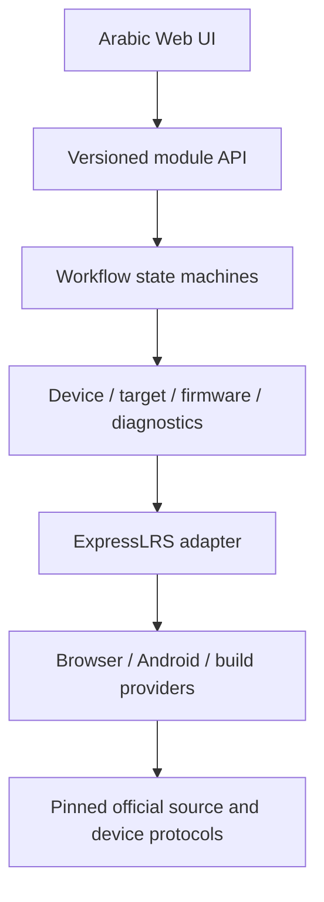

# Phase 0 Discovery Report

Project: ExpressLRS Arabic / Easy Setup
Inspection date: **2026-08-20**
Result: **Discovery accepted for M1 Mock/Foundation; hardware/write/release gates deferred**

## Executive result

يمكن بناء المنتج المطلوب دون إعادة كتابة ExpressLRS. الاتجاه الصحيح هو الاحتفاظ بـExpressLRS الرسمي كمصدر Firmware/Protocol، وبناء طبقة جديدة مستقلة للهوية والتوافق والـWorkflows والتحقق وتجربة عربية سهلة.

الميزة الحقيقية ليست «ترجمة Configurator»؛ بل تحويل العمليات الحساسة من أدوات تقنية إلى workflows آمنة:

```text
Connect
→ collect identity evidence
→ resolve target/capabilities
→ select safe strategy
→ execute
→ reconnect
→ verify real outcome
→ success or recovery
```

## Pinned sources

| Component | Pinned reference |
| --- | --- |
| ExpressLRS stable baseline | `4.1.0` / `a9d4a9cb5b5687c4c9d7e9e7fbdf44ad93651da6` |
| ExpressLRS development awareness | `73ce820ba51437f73f31686233b607c58e188e7b` |
| Configurator | `1.8.3` / `421d656f1987117e37472979444cee464e3fcdef` |
| Web Flasher | `4125a4e07d37ce1e872bb562ebd4286e6fd143f9` |
| Targets | `c4bd7b823594c233e673828ab493a2f8319a756a` |
| Docs | `043f06727b2859dd5e67b725763645df5bccddee` |

Stable 4.1.0 includes SX127x، SX1280 وLR1121. LR2021 وTH920 الموجودان في مرجع التطوير لا يدخلان baseline أو support claim.

## What we will reuse

- Firmware، OTA، FHSS، radio/link behavior الرسمي كما هو في Product MVP.
- PlatformIO/Python build/configuration behavior خلف Build Service.
- runtime `/config` وdevice HTTP/CRSF/MSP semantics خلف adapters.
- official tests ضد upstream baseline وأي patches لاحقة.
- official target catalog كمصدر حقيقة بعد حسم الترخيص، مع SHA ثابت.

## What we will build

- `DeviceIdentityEvidence` وconfidence model.
- `TargetResolver` و`CompatibilityEngine` مركزيان.
- Binding/Update/Recovery state machines.
- provider interfaces للBrowser/Android/build/native.
- verification layer منفصلة عن write/command providers.
- provenance، artifact integrity، operation audit/privacy.
- Arabic-first RTL Easy Mode وAdvanced Mode.

## Critical binding finding

ExpressLRS 4.1.0 يدعم تهيئة UID عبر build/Web UI/CRSF-MSP، إضافة إلى traditional RF binding بطرق دخول متعددة. لكن traditional bind command لا يعيد ACK نهائيًا. انتهاء finite TX bind burst لا يثبت أن RX استلم الهوية.

الحد الأدنى المقترح للنجاح:

```text
Configured/executed
→ normal RF reacquisition
→ bidirectional connected evidence
→ no Model Match/team-race mismatch
→ ideally usable control evidence
```

Device Wi-Fi يوقف الراديو، لذلك `/config` يثبت configuration readback فقط ولا يثبت live RF link.

## Critical update finding

المسارات الرسمية تشمل Wi-Fi، UART، Betaflight/EdgeTX passthrough، XMODEM وSTLink حسب target. الأدوات المفحوصة تصل إلى transport/write completion، لكنها لا تعيد الاتصال وتقرأ target/version/configuration المتوقع بعد reboot.

سيكون contract مشروعنا:

```text
Provider result = WRITE_COMPLETED
Product result = SUCCESS only after post-reboot verification
```

Easy Mode لن يسمح بـ“Flash Anyway” أو blind flashing. كما أن compressed Wi-Fi upload لا يعتمد عليه كtarget check؛ التطبيق يتحقق من artifact المفكوك قبل النقل.

## Device detection result

أقوى runtime evidence متاحة عبر HTTP هي `GET /config`: product، target، version، commit، TX/RX، radio والباندات. mDNS يساعد discovery لكنه غير متاح عمومًا من browser JavaScript وغير موثوق وحده لعملية حساسة.

Generic ESP/STM32 chip، USB VID/PID أو serial manufacturer لا تحدد target. النتيجة تبقى `AMBIGUOUS/UNKNOWN` ويُمنع write.

## Web and Android result

- Chromium desktop هو المرشح الأول لـWeb Serial/WebUSB، لكنه يحتاج user permission وreal-device tests.
- Chrome 148 أعلن Web Serial على Android لـUSB/Bluetooth serial، لكن ExpressLRS hardware/chipsets/lifecycle لم تُختبر بعد.
- public HTTPS إلى device HTTP يمر عبر Local Network Access والمixed-content/network switching constraints.
- Safari/iOS وFirefox Android لا يقدمان نفس direct-device path.
- القرار PWA/Wrapper/Native Bridge مؤجل إلى spike حقيقي.

## RF result

تم رسم TX/RX packet path، OTA/FHSS، scheduling، telemetry، sync، recovery، drivers، و2.4/Sub-GHz boundaries. Shared code لا يعني shared performance effect؛ SX1280 وSX127x وLR1121 تحتاج baselines منفصلة.

تم إنشاء backlog hypotheses فقط. جميعها `UNTESTED` ولا توجد ادعاءات Range/Stability/Latency.

## Recommended architecture



Web recommendation: TypeScript workspace، framework-independent Core، React/Vite UI، ومزودات hardware منفصلة. Android framework لا يُحسم الآن.

Upstream recommendation: independent product repository + immutable pin + ordered patch queue + disposable integration worktree + complete release source bundle. لا permanent product fork ولا floating fetch.

## Licensing and security gates

- Firmware/Configurator/Docs تحمل GPLv3 evidence.
- Web Flasher وTargets لا يملكان repository-level license واضحًا عند SHAs المفحوصة؛ يمنع نسخ/توزيع موادهما حتى التوضيح.
- ExpressLRS name/logo لهما trademark boundary؛ المنتج يحتاج brand مستقل وdisclaimer واضح.
- release يحتاج corresponding source، notices، full provenance، artifact hash وsigned manifest design.
- Binding Phrase/UID/Wi-Fi data لا تحفظ أو تسجل افتراضيًا.

## Exit disposition

وجّه المالك في 2026-08-20 ببدء Foundation عامة دون انتظار موديلات مملوكة. لذلك قُبلت Phase 0 لبدء Core/Mock/RTL/CI فقط، مع بقاء القيود التالية Gates إلزامية قبل أي real write أو support/release claim:

- license blockers؛
- no real browser/Android/reference-hardware matrix؛
- verification per first provider غير مثبت عمليًا؛
- project license/name/release integrity غير معتمدة؛
- reference RF laboratory غير محدد.

بدأ Milestone 1 محليًا وفق [مقترح Foundation المقبول](docs/architecture/milestone-1-proposal.md): Core Model-agnostic، Synthetic Fixtures، Workflows، CI وواجهة RTL بخط Cairo، دون Hardware write.

## Detailed deliverables

- [Architecture map](docs/research/expresslrs-architecture.md)
- [Binding report](docs/research/binding.md)
- [Build/configuration trace](docs/research/build-and-configuration.md)
- [Flashing trace](docs/research/flashing.md)
- [Targets/device detection](docs/research/targets-and-device-detection.md)
- [Web capability study](docs/research/web-capabilities.md)
- [Android risks](docs/research/android-risks.md)
- [RF code map](docs/research/rf-code-map.md)
- [Reuse matrix](docs/research/reuse-matrix.md)
- [Upstream strategy](docs/research/upstream-strategy.md)
- [Licensing](docs/research/licensing.md)
- [Security reconnaissance](docs/research/security-reconnaissance.md)
- [Performance measurement plan](docs/research/performance-measurement-plan.md)
- [Untested hypotheses](docs/research/performance-hypotheses.md)
- [Exit review](docs/research/phase-0-exit-review.md)

## Owner decision

تم تعديل ترتيب التنفيذ صراحة: عدم توفر أجهزة لا يمنع Foundation، لأن الجهاز/الموديل يدخل كبيانات Evidence/Capabilities عبر Catalog/Adapters لا كفروع hard-coded. عند توفر Hardware لاحقًا نثبت provider/target combinations تدريجيًا دون تغيير حدود Core.

No Firmware was modified. No device was flashed. No performance claim was made.
