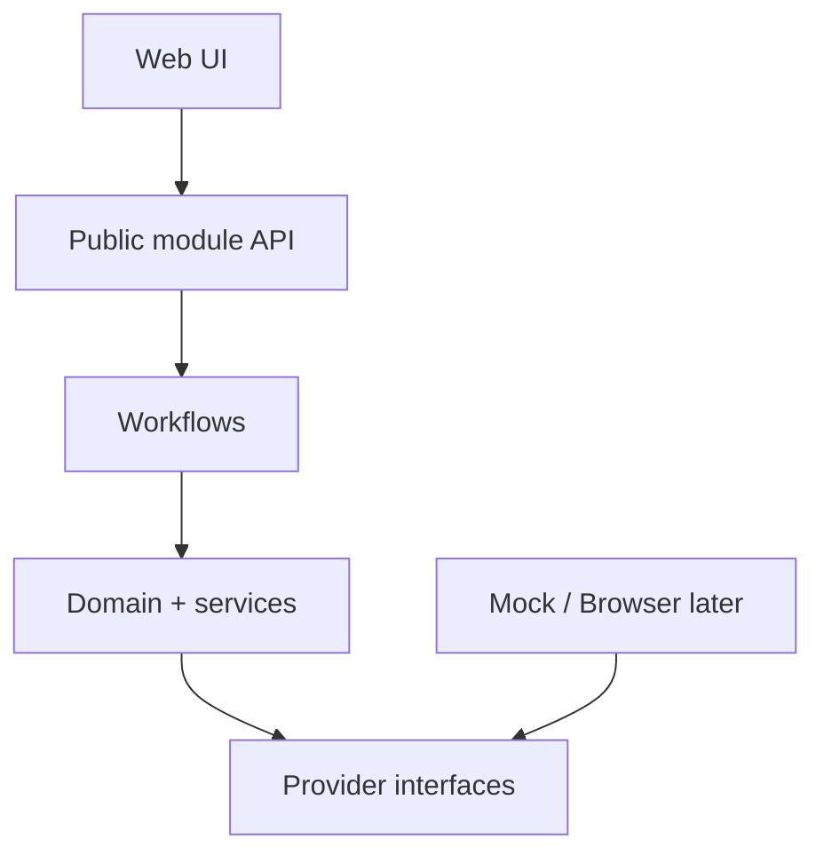

# Milestone 1 Proposal — Project Foundation

Status: **Accepted for implementation on 2026-08-20**. The owner explicitly approved a model-agnostic Foundation without requiring owned hardware. Hardware writes and support claims remain out of scope.

Implementation checkpoint: **candidate implemented and official CI passed; owner acceptance review is pending**. The acceptance gate below is unchanged; see [current evidence](../testing/milestone-1-acceptance.md).

## Goal

إنشاء Foundation مستقرة تختبر حدود المعمارية باستخدام Mocks وFixtures فقط، دون Flash حقيقي أو RF/Firmware changes:

```text
Repository architecture
→ Core contracts
→ Workflow state machines
→ Mock device/providers
→ Arabic RTL Web shell
→ CI and tests
```

## Explicit non-goals

- لا Hardware write أو Firmware build للمستخدم.
- لا نسخ لـWeb Flasher أو Targets غير المرخصين.
- لا Device support claim.
- لا Android framework decision.
- لا Performance patch أو Range claim.
- لا Super-App implementation.

## Proposed workspace

```text
apps/
  web/                    Arabic-first host UI
packages/
  domain/                 value objects, enums, invariants
  device/                 sessions, identity evidence, capabilities
  compatibility/          target/version/provider decisions
  workflows/              binding/update/setup state machines
  expresslrs-adapter/      versioned upstream-facing contracts
  platform-browser/       browser capability contracts; mocks first
  observability/          operation/audit events and privacy classes
  i18n/                   locale resources and terminology
  ui/                     reusable accessible design primitives
tests/
  fixtures/
  unit/
  integration/
docs/
```

الأسماء قابلة للتعديل عند review، لكن اتجاه dependency إلزامي:



لا يعتمد Core على UI أو DOM declarations، ولا تعتمد provider interfaces على
React/DOM/Arabic strings. يستخدم Core `CancellationSignal` structural ويمكن
للـBrowser/Node تمرير native `AbortSignal` إليه.

## First domain contracts

### Device and identity

```text
DeviceDescriptor
DeviceIdentityEvidence
IdentityEvidenceSource
TargetCandidate
TargetResolution
DetectionConfidence
Capability
ConnectionSession
SessionOwner
```

`DeviceIdentityEvidence` يحتفظ بالقيمة الخام والمصدر والوقت والثقة، ولا يستبدل conflicts بقيمة واحدة صامتة.

### Firmware and compatibility

```text
FirmwareSource
FirmwareVersion
FirmwareArtifact
ArtifactProvenance
CompatibilityDecision
CompatibilityReason
TargetCatalog
FlashCapability
VerificationPlan
```

في Milestone 1، `TargetCatalog` يستخدم synthetic fixtures فقط حتى يحسم ترخيص Targets.

### Operations

```text
OperationId
OperationType
OperationState
OperationProgress
OperationResult
OperationError
AuditEvent
RecoveryDisposition
```

الحالات المشتركة المقترحة:

```text
IDLE
PREPARING
WAITING_FOR_CONFIRMATION
EXECUTING
WRITE_COMPLETED
REBOOTING
RECONNECTING
VERIFYING
SUCCESS
FAILED
CANCELLED
UNKNOWN_STATE
RECOVERY_REQUIRED
```

الـprogress يتكون من stage وfacts اختيارية (`bytesWritten`, `totalBytes`) ولا يولد نسبة زمنية وهمية.

## Structured error model

الـCore يعيد codes ثابتة نسبيًا مع details آمنة:

```text
DEVICE_NOT_FOUND
DEVICE_BUSY
PERMISSION_DENIED
CONNECTION_LOST
IDENTITY_UNKNOWN
IDENTITY_AMBIGUOUS
TARGET_UNKNOWN
TARGET_MISMATCH
VERSION_INCOMPATIBLE
PROVIDER_UNSUPPORTED
ARTIFACT_INVALID
VERIFICATION_FAILED
RECOVERY_REQUIRED
```

UI يترجم code إلى:

- ماذا حدث؟
- السبب المحتمل.
- ماذا يفعل المستخدم الآن؟
- technical details عند الطلب.

## Workflow invariants

تُختبر كخصائص لا يمكن كسرها:

1. لا `SUCCESS` دون `VERIFYING` ناجح.
2. `AMBIGUOUS`/`UNKNOWN` identity تمنع أي write path.
3. UI لا يختار Target أو Binding Strategy بنفسه.
4. Provider completion ينتج `WRITE_COMPLETED` فقط.
5. كل retry يعيد التحقق من session/identity قبل resume.
6. operation حساسة تملك single Device Session owner.
7. Arabic strings ليست identifiers.
8. secrets/UID/Wi-Fi values لا تدخل audit events افتراضيًا.

## Mock Device Layer

Fixtures مطلوبة لـ:

- TX 2.4 معروف.
- RX Sub-GHz معروف.
- dual-band LR1121 capability.
- unknown MCU-only device.
- two catalog candidates / ambiguous target.
- conflicting runtime/catalog evidence.
- major-version mismatch.
- permission denial.
- disconnect at every workflow stage.
- reboot followed by same device.
- reboot followed by wrong target/version.
- write completes but device never returns.
- bind command completes but no link.
- connected with Model Mismatch.

Mock time يجب أن يكون controllable حتى تكون timeout/retry tests حتمية.

## Web shell

- React + TypeScript + Vite حسب ADR-0004.
- self-hosted Cairo variable font كخط الواجهة الأساسي.
- `dir="rtl"` وArabic locale من أول render.
- English fallback.
- responsive shell للDesktop/Mobile.
- Easy Mode home: ربط، إعداد، تحديث، تشخيص.
- Advanced Mode entry غير افتراضي.
- capability/unsupported-browser messaging.
- accessible focus, keyboard, labels, contrast and error summaries.

لا يظهر أي زر Hardware حقيقي في Milestone 1؛ كل workflows موصولة إلى Mock providers بوسم واضح.

لا توجد `switch` branches بأسماء موديلات؛ Target/Catalog/Capability data تدخل عبر contracts قابلة للحقن.

## Testing foundation

### Static/CI

- formatter/linter.
- TypeScript strict checking.
- dependency lockfile.
- unit/integration/UI smoke tests.
- production Web build.
- license/security dependency checks بعد اختيار packages.
- Markdown/local-link verification.

### Core tests

- confidence-resolution tables.
- compatibility reasons.
- operation transition legality.
- failure and retry paths.
- no-success-before-verification invariant.
- privacy redaction.
- deterministic diagnostic fixtures.

### UI/i18n tests

- Arabic Easy Mode has no missing strings.
- English fallback works.
- RTL layout and focus smoke tests.
- errors map from structured codes, not English/Arabic matching.
- mobile/desktop viewport smoke tests.

## Dependency admission

كل dependency تُقبل فقط بعد تسجيل:

- necessity and alternatives؛
- maintenance/security status؛
- license compatibility؛
- bundle/runtime cost؛
- exact pinned version/lockfile.

لا تُختار state-machine library أو monorepo tool قبل مقارنة تعقيدها مع implementation صغير typed.

## Deliverables

- repository/workspace manifests.
- Core contracts and dependency rules.
- operation/binding/update state machines.
- mock/replay fixtures.
- Arabic RTL Web shell.
- structured errors and audit/privacy schema.
- CI checks and test suites.
- accepted ADRs and developer documentation.

## Acceptance gate

Milestone 1 يكون جاهزًا عندما:

- dependency direction enforced.
- Core tests run without DOM/browser.
- all workflow failure fixtures end in correct non-success state.
- Mock Easy Binding/Update demonstrate verification and recovery.
- Arabic RTL/English fallback smoke tests pass.
- CI clean.
- no upstream source copied and no hardware write implementation exists.

## Deferred to Milestone 2+

- first real connection is read-only: `Connect → Identify → Read → Display`.
- Target catalog materialization awaits license resolution.
- Browser Serial/USB/HTTP providers await the relevant spikes.
- Android awaits real-device capability study.
- any Firmware/RF work awaits performance infrastructure.
