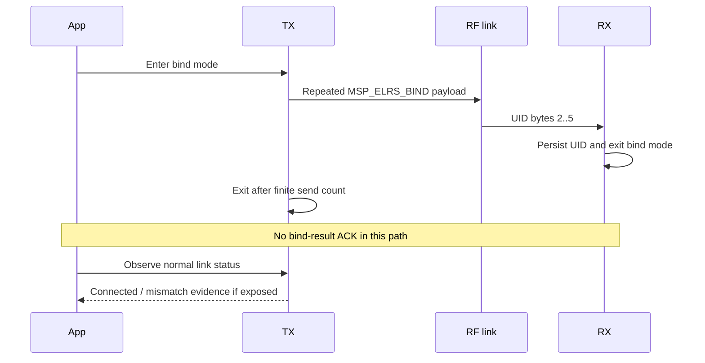
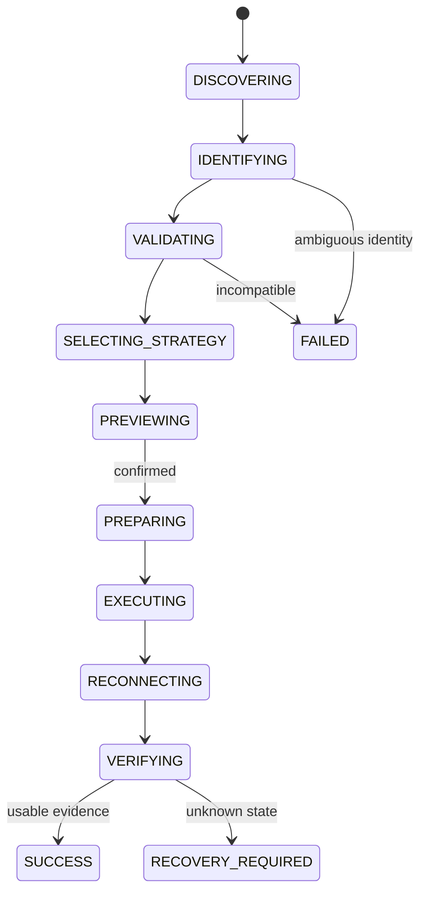

# Binding Source Trace and Easy Binding Architecture

Baseline: ExpressLRS `4.1.0` / `a9d4a9cb5b5687c4c9d7e9e7fbdf44ad93651da6`. الدراسة `CODE_REVIEWED`؛ لا يوجد Hardware validation بعد.

## النتيجة التنفيذية

لا توجد طريقة واحدة اسمها «Binding» في ExpressLRS. توجد طريقتان رئيسيتان لتوحيد الهوية، وعدة طرق لإدخال الأجهزة في الوضع المناسب:

1. **تهيئة Binding identity** بحيث يحمل TX وRX نفس UID، عبر Build/Web UI/CRSF-MSP.
2. **Traditional over-air bind** حيث يبث TX آخر أربعة bytes من UID ويتلقاها RX ويحفظها.

في مسار traditional bind لا يوجد bind-result ACK نهائي. إرسال الأمر أو انتهاء عدد حزم الربط لا يثبت أن RX استلم الهوية أو أن الرابط أصبح صالحًا. لذلك تعريف المنتج هو:

```text
Command accepted != Bind verified
UID readback != Live link verified
Connected + no mismatch = minimum usable-link evidence
```

## Binding identity

ExpressLRS يستخدم UID من ستة bytes. عند استخدام Binding Phrase في المسارات المفحوصة:

1. يُبنى النص الدقيق `-DMY_BINDING_PHRASE="<phrase>"`.
2. يُحسب MD5.
3. تُستخدم أول ستة bytes كـUID.

المواضع الرسمية التي تنفذ هذه semantics:

- `src/python/build_flags.py` للبناء.
- `src/html/src/pages/binding-panel.js` في device Web UI.
- `BindphraseConfigurable::SetBindPhrase()` في `src/lib/CONFIG/config.cpp`.
- `binary_configurator.py::generateUID` للمسار binary.
- `RxTxEndpoint::handleMspSetRxTxConfig()` في 4.1 runtime CRSF/MSP.

الجهاز يحفظ UID، لا phrase نفسها، لكن Debug build قد يسجل phrase عند مسار runtime. مشروعنا يمنع phrase/UID من logs وexports ويجعل persistence للـphrase غير افتراضي.

## Methods inventory

### A. توحيد الهوية مباشرة

| الطريقة | TX/RX requirements | ما يتغير | Reboot/physical step | قابلية الأتمتة | التحقق المتاح |
| --- | --- | --- | --- | --- | --- |
| Build-time Binding Phrase | Source/prebuilt configurator ومسار flash مناسب | UID ضمن artifact/config | Flash ثم reboot | `GUIDED` أو `AUTOMATIC` بعد Target gate | Artifact + post-reboot UID/config، ثم link check |
| Device Web UI phrase/UID | Wi-Fi mode وendpoint مناسب | TX `/options.json` أو RX `/config` | Reboot/الخروج من Wi-Fi | `AUTOMATIC` بعد LNA/network permission | Config readback فقط؛ RF متوقف في Wi-Fi |
| CRSF/MSP runtime get/set (4.1) | Transport يستطيع الوصول إلى `RxTxEndpoint` | UID أو phrase ثم scheduled reboot | Reboot | `AUTOMATIC` إذا capability confirmed | Command/readback، ثم RF reconnect |
| User matches existing UID manually | Access محدود أو device-specific | حسب الأداة | غالبًا خطوات موجهة | `MANUAL_STEP_REQUIRED` | لا نجاح إلا بدليل مستقل |

### B. Traditional over-air binding triggers

| Trigger | المتطلبات | قيود مهمة | Strategy output المبدئي |
| --- | --- | --- | --- |
| RX غير مربوط | آخر أربعة UID bytes صفر | يجب أن يكون TX في bind mode ومتوافقًا | `GUIDED`/`AUTOMATIC` حسب تحكم TX |
| Power cycle ثلاث مرات | RX يدعم counter، توقيت رسمي | خطوة physical، حساسة للتوقيت | `MANUAL_STEP_REQUIRED` |
| RX button/boot pad | Hardware يملك button/pad mapping | ليس كل target يملك LED/button نفسه | `MANUAL_STEP_REQUIRED` |
| Betaflight 4.5+ `bind_rx` | FC وCRSF serial path مناسب | passthrough/capability يجب اكتشافهما | `AUTOMATIC` أو `GUIDED` |
| RX Lua/CRSF parameter | RX متصل ويمكن إرسال parameter | قد يخرج أولًا من الرابط؛ loan/admin modes | `AUTOMATIC` إذا provider يستطيع command |
| TX Lua/CRSF Bind command | وصول إلى TX parameter/command | الأمر fire-and-forget بلا bind ACK | `AUTOMATIC` للتنفيذ، لا للتحقق |

RX binding storage modes في `rx_config_bindstorage_t` هي `PERSISTENT`, `VOLATILE`, `RETURNABLE`, `ADMINISTERED`. وضع `ADMINISTERED` يمنع الدخول إلى traditional RF bind، و`RETURNABLE` يملك loan/return semantics. يجب أن تكون capability في Core، لا checkbox عشوائيًا في UI.

## Traditional RF sequence



التتبع الدقيق في 4.1.0:

1. `SendUIDOverMSP()` في `tx_main.cpp` يرسل `MSP_ELRS_BIND` مع UID bytes 2–5 عبر `DataUlSender`.
2. `EnterBindingMode()` يغير CRC initializer إلى `OTA_VERSION_ID`، nonce إلى صفر، inverted IQ، و`RATE_BINDING` الثابت.
3. TX يستخدم `BindingSpamAmount = 25` ويخرج عندما يصبح counter `> 25`. هذا حد تنفيذ، لا دليل استلام.
4. LR1121 يقسم bind attempts بين Sub-GHz و2.4 GHz؛ RX يبدل bind rates حسب الكود.
5. `ProcessRfPacket_DataUl()` في RX يلتقط `MSP_ELRS_BIND`.
6. `OnELRSBindMSP()` يصفر UID bytes 0–1 وينسخ bytes 2–5.
7. `ExitBindingMode()` يحفظ UID ويعيد CRC/FHSS/scanning إلى المسار الطبيعي.

## Evidence ladder

| Level | Evidence | ماذا يثبت؟ | هل يكفي لـ`SUCCESS`؟ |
| --- | --- | --- | --- |
| E0 | User pressed bind / command dispatched | Intent فقط | لا |
| E1 | Provider returned without error | التنفيذ المحلي لم يفشل بوضوح | لا |
| E2 | UID/config readback matches | الهوية حُفظت على الجهاز المقروء | لا؛ لا يثبت رابط RF |
| E3 | RX reached internal connected state | استقبال packets صالحة وsync/LQ مناسب | قوي، لكن يحتاج surface قابلة للرصد |
| E4 | TX reports `connectionState == connected` | Bidirectional link مع downlink CRC صالح | الحد الأدنى مع mismatch check |
| E5 | Connected + no Model Match/team-race mismatch | رابط صالح لهوية/model المتوقعة | نعم كحد أدنى للربط |
| E6 | Control data observed usable | تحكم فعلي بعد الربط | أفضل دليل، لكنه platform-specific |

### Why `C` is not enough alone

TX يضع bit الاتصال عندما تكون `connectionState == connected`. Lua يعرض `C`. لكن Model Mismatch هو bit منفصل ويمكن أن يظهر مع `C`. لذا verifier يجب أن يطلب:

- connected evidence؛
- عدم وجود Model Match/team-race mismatch؛
- ويفضل اختبار control continuity إذا كانت المنصة تعرضه.

LED يمكن أن يكون Evidence موجهًا للمستخدم فقط، لأن pin/color/inversion/RGB وحتى وجود LED تختلف حسب target.

### Wi-Fi limitation

دخول device Wi-Fi يضع الحالة `wifiUpdate`، يوقف hardware timer وينفذ `Radio.End()`. لذلك:

- `/config` يستطيع إثبات UID/config readback؛
- لا يستطيع في نفس الوقت إثبات live RF link؛
- workflow Wi-Fi يجب أن يخرج من Wi-Fi، يسمح بإعادة RF acquisition، ثم يستخدم TX CRSF/Lua أو FC/serial أو guided LED evidence.

## Binding Strategy Engine

### Inputs

```text
TX identity + RX identity
+ Firmware major/version
+ Target/radio/band capabilities
+ Available transports
+ Binding storage mode
+ Current connection/Wi-Fi state
+ Verification surfaces
```

### Output

| Result | Meaning |
| --- | --- |
| `AUTOMATIC` | التطبيق يستطيع التحضير والتنفيذ وجمع verification آليًا |
| `GUIDED` | التطبيق ينفذ معظم الخطوات ويطلب خطوة بشرية واضحة |
| `MANUAL_STEP_REQUIRED` | خطوة physical أو external tool لا يمكن تجاوزها |
| `UNSUPPORTED` | الجهاز/الإصدار/transport لا يدعم المسار بأمان |
| `AMBIGUOUS` | الهوية أو capabilities أو compatibility غير مؤكدة؛ توقف |

اختيار strategy يجب أن يكون deterministic ومصحوبًا بـ`reasons[]` و`requiredEvidence[]`. لا تُضمّن النصوص العربية في business logic.

## Easy Binding workflow



قاعدة الانتقال: `EXECUTING → RECONNECTING`, وليس `EXECUTING → SUCCESS`.

## Friction and opportunity map

| Friction ثبتت بالدراسة | ماذا نستطيع فعله؟ | ما لا يجوز تخمينه؟ |
| --- | --- | --- |
| المستخدم يختار Target/role/band يدويًا | نقرأ `/config`/transport evidence ونحل target | لا نختار من MCU/USB bridge وحده |
| phrase/UID يدخل من أدوات ومسارات مختلفة | نوحد semantics في Binding Service ونختبرها مقابل upstream | لا نخترع hash/UID algorithm جديدًا |
| طرق الدخول إلى bind mode متعددة | Strategy engine يختار أو يرشد حسب capabilities | لا نفترض وجود button/LED/Betaflight |
| أمر Bind بلا ACK نهائي | نفصل execution عن verification | لا نحول send-count أو process exit إلى نجاح |
| Wi-Fi يعطل RF | workflow ثنائي المرحلة: config ثم RF verification | لا ندعي live link من `/config` |
| Model Mismatch منفصل عن Connected | verifier يفحص الاثنين | لا نكتفي بـ`C` |
| failure يعيد المستخدم يدويًا للبداية | state checkpoint + targeted retry | لا نعيد write/config دون re-identification |

## Failure and retry model

أكواد failure المبدئية:

- `DEVICE_LOST`
- `IDENTIFICATION_FAILED`
- `TARGET_AMBIGUOUS`
- `INCOMPATIBLE_MAJOR_VERSION`
- `BINDING_METHOD_UNSUPPORTED`
- `PREPARATION_FAILED`
- `COMMAND_NOT_ACCEPTED`
- `REBOOT_TIMEOUT`
- `LINK_NOT_OBSERVED`
- `MODEL_MISMATCH`
- `CONTROL_NOT_VERIFIED`
- `UNKNOWN_STATE`

Retry يعيد التحقق من connection/identity/capabilities أولًا، ثم يكمل من آخر checkpoint صالح. لا يعاد إرسال write أو bind تلقائيًا إذا تغيرت حالة الجهاز.

## Privacy policy

- لا حفظ افتراضي لـBinding Phrase أو derived UID.
- لا phrases/UIDs في logs، analytics، crash reports أو diagnostic exports.
- أي persistence مستقبلية opt-in، محلية، قابلة للمسح، مع retention واضح.
- Operation log يسجل `binding identity configured` دون القيمة.

## Acceptance tests المطلوبة

- phrase/UID parity fixtures مقابل كل implementation رسمي.
- TX/RX compatible وmajor-version mismatch.
- runtime configuration، traditional bind، وphysical-step strategies.
- `ADMINISTERED`, `RETURNABLE`, unbound receiver states.
- device loss قبل/أثناء/بعد execution.
- command completes لكن لا يظهر link.
- connected مع Model Mismatch.
- Wi-Fi config readback ثم normal RF reconnect.
- retry من كل checkpoint.
- Arabic/English errors، privacy scrubber، وno-success-before-verification invariant.

## أسئلة مفتوحة/No-Go

- أي Browser/Android provider يستطيع قراءة TX connection/mismatch آليًا على Reference Hardware؟
- هل نحتاج FC bridge للتحقق الآلي من usable control في MVP، أم Guided verification موثق لبعض الأجهزة؟
- ما compatibility matrix الدقيق بين 3.x و4.x لكل method؟ 4.1.0 يذكر توافق 4.x hardware، لكنه لا يلغي major-version checks.
- يلزم حسم تناقض في الوثائق حول manual binding لRX ذي UID؛ السلوك عند SHA المثبت هو المرجع المؤقت.
- تعليق source يقول تبديل LR1121 كل 500ms بينما constant الحالي 125ms؛ لا نبني UX timeout ثابتًا قبل hardware test.

## قرار Phase 0

Easy Binding ممكن معماريًا، لكن ليس «زر Bind» بسيطًا. Product value الحقيقي سيكون Strategy Engine + أقل input + fail-closed compatibility + verification ladder + recovery. التنفيذ على Hardware يبقى محظورًا حتى قبول Phase 0 وإتمام transport spikes.
