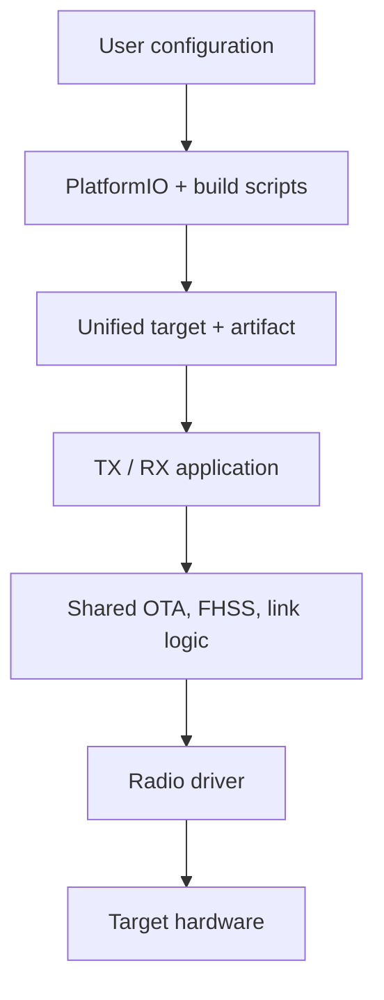
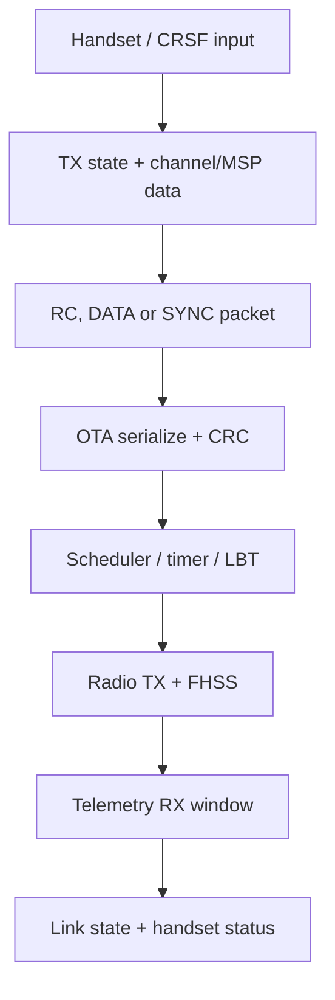
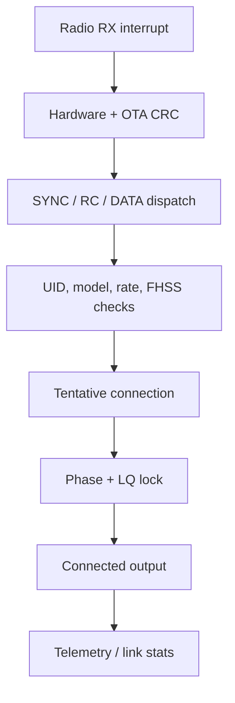
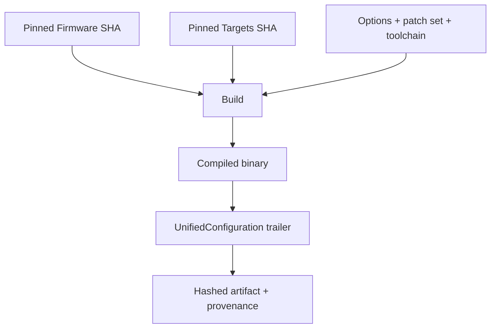

# ExpressLRS Architecture Map

تاريخ الفحص: **2026-08-20**. هذا التقرير يصف البنية التي يحتاجها مشروعنا، وليس توثيقًا عامًا لكل ExpressLRS.

## حدود الدراسة

- خط السلوك المستقر: ExpressLRS `4.1.0` عند `a9d4a9cb5b5687c4c9d7e9e7fbdf44ad93651da6`.
- مرجع التطوير للمقارنة فقط: `master` عند `73ce820ba51437f73f31686233b607c58e188e7b`.
- Targets التي فُحصت: `c4bd7b823594c233e673828ab493a2f8319a756a`.
- Validation: `CODE_REVIEWED` فقط؛ لم تُجرَ كتابة Firmware أو اختبارات Hardware/RF.

## الخريطة العليا



الـTX والـRX لا يعيشان في مستودعين مستقلين. الدور يُختار وقت البناء بواسطة `TARGET_TX` أو `TARGET_RX`، وكذلك عائلة الراديو بواسطة flags مثل `RADIO_SX127X` و`RADIO_SX128X` و`RADIO_LR1121`.

## مسؤوليات المستودع الرسمي

| المسؤولية | المسار الرسمي في 4.1.0 | الرموز/المكونات المهمة | ما يعنيه ذلك لنا |
| --- | --- | --- | --- |
| نقطة بناء PlatformIO | `src/platformio.ini` | استيراد بيئات `src/targets/*.ini` | Build Service يجب أن يلتف حول الاختيار الرسمي بدل نسخه داخل UI |
| تعريف الدور والمنصة والراديو | `src/targets/common.ini` وملفات platform | `TARGET_TX`, `TARGET_RX`, `RADIO_*` | الـTarget ليس اسمًا تجميليًا؛ يحدد مسارًا تنفيذيًا وArtifact |
| تطبيق TX | `src/src/tx_main.cpp` | setup، packet generation، scheduling، telemetry receive، binding | أي تغيير هنا RF/timing-sensitive |
| تطبيق RX | `src/src/rx_main.cpp` | scan/sync، packet receive، telemetry send، recovery، binding | مصدر حالة الرابط والتحقق الفعلي |
| منطق TX/RX المشترك | `src/src/rxtx_common.*`, `src/src/common.cpp`, `src/include/common.h` | جداول المعدلات وخصائص RF المشتركة | Patch مشترك قد يؤثر في أكثر من Band/Radio |
| بروتوكول OTA | `src/lib/OTA/` | packet layouts، CRC، serializers، UID seed | لا نعيد كتابة البروتوكول في Product Core |
| Frequency hopping | `src/lib/FHSS/` | regulatory domains، sequence generation، dual-band helpers | حساس للتوافق والتنظيم والقياس |
| طبقة الراديو | `src/lib/SX12xxDriverCommon/` وعائلات drivers | `Config`, `TXnb`, `RXnb`, stats | النتائج لا تُعمّم بين عائلات الراديو |
| التوقيت والمزامنة | `src/lib/HWTIMER/`, `src/lib/PFD/` | timer callbacks، phase/frequency correction | نقاط قياس latency/jitter/recovery |
| الإعداد والتخزين | `src/lib/CONFIG/`, `src/lib/elrs_eeprom/`, `src/lib/OPTIONS/` | UID، runtime options، hardware layout | يلزم فصل facts عن provenance والثقة |
| Wi-Fi/Web UI | `src/lib/WIFI/`, `src/html/` | `/config`, `/update`, reboot/config APIs | Runtime adapter مهم، لكنه ليس Product UI |
| CRSF/Lua/MSP | `src/lib/CrsfProtocol/`, `src/lib/tx-crsf/`, `src/lib/rx-crsf/`, `src/lua/` | commands، device parameters، link status | مسار قوي للربط والتحقق حسب المنصة |
| serial protocols | `src/src/rx-serial/` | CRSF، SBUS، MAVLink وغيرها | لا نفترض أن Browser يرى خرج التحكم دائمًا |
| telemetry/reliable data | `src/lib/StubbornSender/`, `StubbornReceiver/`, `LQCALC/`, `LBT/`, `src/src/dynpower.cpp` | delivery state، link stats، power/LBT | Measurement hooks قبل أي Optimization |
| أدوات build/flash | `src/python/` | `build_flags.py`, `UnifiedConfiguration.py`, `binary_configurator.py`, passthrough helpers | تُستدعى/تُلف خلف Service؛ لا تدخل React |
| الاختبارات | `src/test/` | CRC، FHSS، OTA، telemetry، stubborn، CRSF/MSP | نعيد تشغيلها على baseline وأي patch لاحقًا |

## مسار TX



المسارات الأساسية هي `SendRCdataToRF()`, `GenerateSyncPacketData()`, `timerCallback()` و`TXdoneISR()` في `tx_main.cpp`. حالة اتصال TX لا تأتي من تنفيذ أمر Bind، بل من حزم downlink telemetry ذات hardware/OTA CRC صالح ضمن نافذة زمنية محددة.

## مسار RX



المسارات المهمة هي `ProcessRFPacket()`, `ProcessRfPacket_SYNC()`, `ProcessRfPacket_RC()`, `TentativeConnection()`, `GotConnection()`, `LostConnection()` و`cycleRfMode()` في `rx_main.cpp`.

خرج التحكم لا يُمرر لمجرد وجود packets: في 4.1.0 يتطلب RX حالة `connected` وModel Match صالحًا واكتمال channel data. لذلك التحقق من «رابط قابل للاستخدام» أقوى من نجاح command أو كتابة UID.

## Build/configuration boundary



- `build_flags.py` يقرأ `user_defines.txt` ثم `super_defines.txt`، يتحقق من خيارات band/radio، يحول Binding Phrase إلى UID، ويضمّن version/commit/target/options.
- `UnifiedConfiguration.py` يضيف product/Lua names، options، hardware layout، logo/legacy target metadata.
- `binary_configurator.py` يطبق منطقًا مشابهًا على prebuilt binary.
- Firmware SHA وحده لا يكفي لإعادة إنتاج Build؛ Targets/toolchain/dependencies والـ`flash-discriminator` العشوائي Inputs مستقلة.

## Configuration and device evidence

أقوى سطح runtime read-only عُثر عليه هو `GET /config` في `src/lib/WIFI/devWIFI.cpp`. يعيد، حسب الجهاز/الإصدار، product، unified target، version، commit، TX/RX، radio type، bands/domains وخيارات ذات صلة.

هذه بيانات ذاتية من الجهاز وليست توقيعًا تشفيريًا. `DeviceIdentityEvidence` في مشروعنا يجب أن يحتفظ بـ:

- القيمة الخام.
- المصدر/الـtransport.
- وقت القراءة.
- الثقة.
- التعارضات مع الأدلة الأخرى.

لا يقرر UI الـTarget. يقوم `TargetResolver` و`CompatibilityEngine` بذلك ثم يعيدان نتيجة structured.

## Binding boundary

ExpressLRS 4.1.0 يدعم مفهومين مختلفين يجب ألا نخلطهما:

1. **Configuration of binding identity:** Build-time، Web UI، أو CRSF/MSP runtime set/get للـUID/phrase.
2. **Traditional over-air bind:** TX يرسل جزء UID في finite RF burst وRX يحفظه ثم يعيد acquisition.

لا يوجد ACK نهائي في مسار traditional bind الذي تم تتبعه. لذلك `BindingProvider.execute()` لا يعيد `SUCCESS`; يعيد Evidence التنفيذ، ثم Workflow مستقل يعيد الاتصال ويتحقق من رابط فعلي ومن عدم Model Mismatch.

التفاصيل في [binding.md](binding.md).

## Update boundary

المسارات الرسمية تشمل Wi-Fi OTA، ESP UART، Betaflight passthrough، EdgeTX passthrough، XMODEM/STLink بحسب target، إضافة إلى تحديث Firmware داخلي لراديو LR1121 كعملية مختلفة عن Firmware التطبيق.

نجاح write API أو process exit يعني `WRITE_COMPLETED`. مشروعنا يضيف `REBOOTING → RECONNECTING → VERIFYING` قبل `SUCCESS`.

## الاختبارات الموجودة والفجوات

المصدر يملك unit/native tests مفيدة لـCRC/FHSS/OTA/telemetry/stubborn/CRSF/MSP. لم يظهر في المسارات المفحوصة Harness حتمي كامل لـ:

- transaction الربط التقليدي من بدايته إلى رابط صالح؛
- post-flash identity verification عبر جميع providers؛
- زمن recovery عبر radios/bands؛
- أداء end-to-end تحت degradation مضبوط.

هذه فجوات مختبر مشروعنا وليست ادعاءً بعدم وجود اختبارات خارج المستودع.

## قرار إعادة الاستخدام المقترح

- يبقى Firmware/OTA/FHSS/radio/link الرسمي هو التنفيذ، دون Fork منتج ضخم.
- تُلف أدوات build الرسمية أولًا بدل إعادة بنائها.
- تُكيف APIs/runtime evidence خلف ExpressLRS adapter مستقل.
- لا يُنسخ Configurator أو Web Flasher كواجهة المنتج.
- يبقى Workflow/compatibility/verification منطقًا جديدًا خاصًا بنا ومستقلًا عن React.
- أي Firmware patch لاحق يكون patch queue قابلًا للإزالة ومربوطًا بتجربة وقياس.

## أسئلة مفتوحة تمنع التعميم

- أي transports تعرض link-status آليًا للتطبيق بعد Binding؟
- أي targets تعرض exact identity في bootloader أو بعد reboot؟
- ما Snapshot الـTargets المستخدم فعليًا في official 4.1.0 artifacts؟
- كيف تُعرّف reproducible binary مع `flash-discriminator` العشوائي؟
- ما أول Hardware matrix يغطي SX1280 وSX127x أو LR1121 بأمان؟

## النتيجة

البنية المناسبة ليست «React يتكلم مباشرة مع أدوات flash»، بل:

```text
UI
→ Workflow state machines
→ Core services and compatibility rules
→ ExpressLRS integration adapter
→ Browser/Android/build providers
→ Pinned official source, tools, and device protocols
```

Confidence: **CONFIRMED** لمسارات المصدر، و**HIGH_CONFIDENCE** لحدود Product architecture، و**UNVALIDATED** لإمكانات hardware/browser الفعلية.
