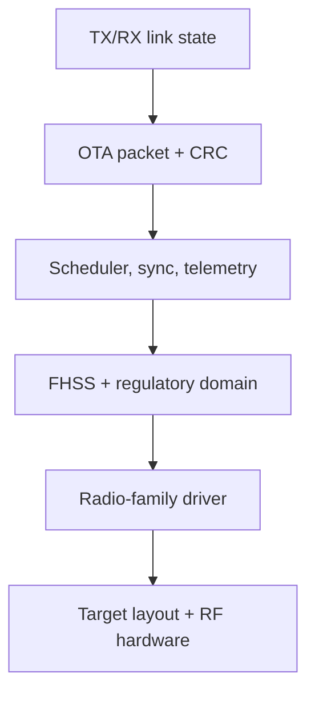
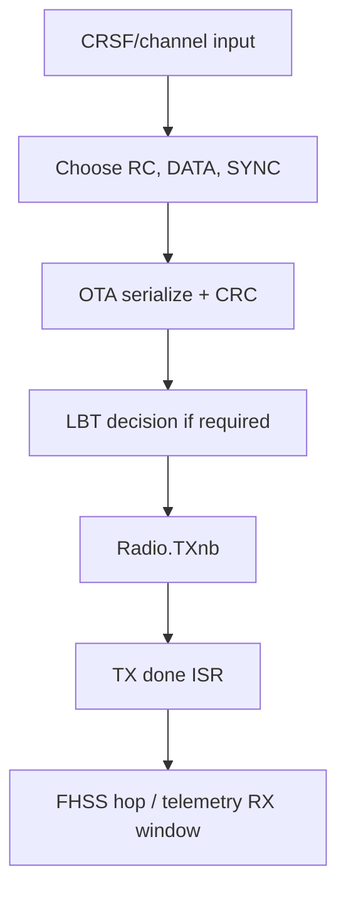
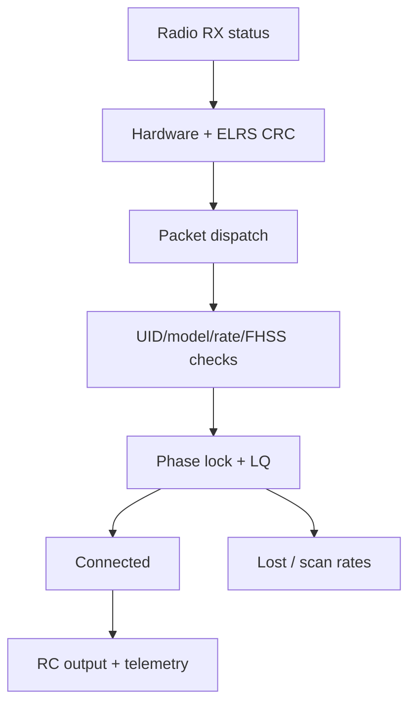

# RF Code Map — 2.4 GHz and Sub-GHz

تاريخ الفحص: 2026-08-20. Baseline مستقر: ExpressLRS `4.1.0` عند `a9d4a9cb5b5687c4c9d7e9e7fbdf44ad93651da6`. مرجع التطوير منفصل: `73ce820ba51437f73f31686233b607c58e188e7b`.

> هذا Map للقراءة والقياس فقط. لم يُعدّل RF code ولم يُبنَ Candidate ولم يُختبر أداء.

## Baseline boundary

| Source state | Radio families / domains relevant to this map | Product status |
| --- | --- | --- |
| Stable 4.1.0 | SX127x، SX1280، LR1121؛ 2.4 `ISM2G4`/`CE_LBT`؛ Sub-GHz `AU915`, `FCC915`, `EU868`, `IN866`, `AU433`, `EU433`, `US433`, `US433W` | Official research baseline |
| Development HEAD | يضيف LR2021، ويحتوي `TH920` ضمن التطوير الحالي | Watch-only؛ ليس جزءًا من 4.1 baseline أو support claim |

لا يجوز دمج facts من Development HEAD داخل نتائج stable دون وسم. وجود driver في source لا يعني `HARDWARE_TESTED` أو `STABLE` في منتجنا.

## Layer map

| Concern | Shared source | 2.4 GHz stable | Sub-GHz stable | Multi/dual-band stable |
| --- | --- | --- | --- | --- |
| Driver base | `src/lib/SX12xxDriverCommon/` | `src/lib/SX1280Driver/` | `src/lib/SX127xDriver/` | `src/lib/LR1121Driver/` |
| Rate/modulation tables | `src/src/common.cpp`, `src/include/common.h` | SX1280 LoRa/FLRC entries | SX127x LoRa entries | LR1121 sub-GHz/2.4/dual entries |
| Packet format | `src/lib/OTA/` | Shared framing؛ driver config مختلف | Shared framing؛ driver config مختلف | Shared model مع band/radio selection |
| FHSS | `src/lib/FHSS/` | ISM2G4 أو CE_LBT، 80 channels في 4.1 code | Regional table حسب compile configuration | primary/secondary sequences وdual-band helpers |
| TX scheduling | `src/src/tx_main.cpp` | SX1280 config وCE LBT عند انطباقه | SX127x config/frequency behavior | primary/dual selection وGemini paths |
| RX sync/phase | `src/src/rx_main.cpp`, `src/lib/PFD/`, `src/lib/HWTIMER/` | SX1280 seed/CRC/config | SX127x frequency correction | LR1121 band/radio parameters |
| Recovery | `LostConnection`, `cycleRfMode`, RF performance tables | scans supported SX1280 rates | scans supported SX127x rates | filters rates by radio count/power/capability |
| Binding rate | `RATE_BINDING`, bind CRC، inverted IQ | 2.4 LoRa 50 Hz path | Sub-GHz LoRa 50 Hz path | alternates/subdivides bind attempts across bands |

## TX packet and timing path

أهم الرموز:

- `SetRFLinkRate()` يطبق إعدادات rate/radio الحالية.
- `GenerateSyncPacketData()` يرسل FHSS index، nonce، RF rate، switch encoding، telemetry ratio، link mode وآخر UID bytes.
- `SendRCdataToRF()` يختار نوع uplink ويطبق CRC وLBT ثم `Radio.TXnb()`.
- `timerCallback()` يحدد cadence.
- `TXdoneISR()` ينفذ hop ويفتح telemetry receive window عند الحاجة.
- `ProcessDownlinkPacket()` و`UpdateConnectDisconnectStatus()` يبنيان حالة الاتصال من telemetry صالحة.

## RX packet, sync and recovery path

أهم الرموز:

- `ProcessRFPacket()` يتحقق من radio/OTA CRC ويحدث packet statistics/frequency correction.
- `ProcessRfPacket_SYNC()` يتحقق من UID/model/rate/FHSS/timing ثم يبدأ tentative connection.
- `updatePhaseLock()` يستعمل PFD/filters وتعديل timer frequency/phase.
- `GotConnection()` و`LostConnection()` يديران state transitions/reset.
- `cycleRfMode()` يمسح supported rates عندما يكون الرابط مفقودًا.
- `ProcessRfPacket_RC()` يمرر control data فقط مع connection وModel Match صالحين.
- `HandleSendDataDl()` يجدول link stats/segmented telemetry وفق denominator/bursts/LBT/diversity.

## Shared versus band-specific logic

### Shared

- OTA packet layouts, CRC and serializers.
- UID-derived OTA/FHSS seeds.
- FHSS sequence-generation structure.
- TX/RX state machines and scheduler shape.
- LQ calculation and link statistics representation.
- reliable segmented data via `StubbornSender`/`StubbornReceiver`.
- connection/recovery hooks and rate-table abstraction.

### 2.4 GHz-specific or radio-specific

- SX1280 driver and LoRa/FLRC configurations.
- 2.4 rate/modulation/timing entries.
- `ISM2G4` و`CE_LBT` tables.
- CE LBT thresholds/settling/timing paths in `src/lib/LBT/`.

### Sub-GHz-specific or radio-specific

- SX127x driver/frequency register/correction behavior.
- Sub-GHz rate/modulation/timing entries.
- regional FHSS domains and channel counts/ranges.
- region/power rules that must remain aligned with upstream and law.

### LR1121 multi/dual-band

- supports low/high band paths and dual/Gemini configurations.
- must filter requested modes against actual target radios/power tables.
- has distinct radio-chip firmware update path under device Wi-Fi; this is not normal MCU Firmware update.
- a successful LR1121 result cannot automatically be claimed for SX127x or SX1280.

## Telemetry interaction

- OTA downlink may carry link stats or segmented data.
- `HandleSendDataDl()` uses negotiated telemetry denominator and burst counters.
- TX opens receive windows according to scheduling and consumes CRC-valid downlink packets.
- `LinkStatsToOta()` includes RSSI, antenna, model match, LQ/diversity/SNR facts.
- Reliable payload delivery uses acknowledged Stubborn sender/receiver state.

أي candidate يتعلق بcontrol scheduling يجب قياس telemetry throughput/latency، وأي telemetry change يجب قياس packet continuity/control latency/recovery.

## Recovery model observed

Recovery ليس function واحدة. يتضمن:

1. كشف تجاوز lock/disconnect timeout.
2. `LostConnection()` وإعادة filters/serializers/scanning state.
3. `cycleRfMode()` بين supported rates.
4. استقبال SYNC صالح ومتوافق.
5. `TentativeConnection()`.
6. phase/LQ thresholds ثم `GotConnection()`.
7. زمن إضافي للوصول إلى timing lock المستقر.

تعريف benchmark المقترح لـ`usable link restored` يجب تحديد start/end بدقة، ويفضل قياس:

- loss detection؛
- scan/recovery initiation؛
- first CRC-valid packet؛
- tentative connection؛
- connected + model match؛
- first usable control output؛
- stable timing lock.

## Measurement insertion points

| Metric | Source hook | External validation needed |
| --- | --- | --- |
| packet event/burst loss | `ProcessRFPacket()`, `LQCALC` | packet sequence/timestamp collector |
| TX cadence/jitter | `timerCallback()`, `TXdoneISR()` | logic analyzer/GPIO timestamps |
| RX phase/timing | Tick/Tock callbacks، `PFDloop`, `updatePhaseLock()` | external timing to measure instrumentation overhead |
| recovery phases | `LostConnection`, `cycleRfMode`, `TentativeConnection`, `GotConnection` | controlled attenuation/degradation event |
| telemetry competition | telemetry denominator، `HandleSendDataDl()`, sender ACK state | paired control + telemetry raw events |
| CPU timing | radio callbacks/ISR/main loop | deadline misses and instrumented execution time |
| RAM/flash | build reports/map files | identical pinned toolchain/target/options |

`DEBUG_RCVR_LINKSTATS` يغير بعض filtering behavior في RX؛ لا يُفترض أنه measurement-neutral. يجب مقارنة instrumentation داخليًا بقياس خارجي.

## Existing tests and additions required

### Existing useful tests

- CRC.
- FHSS sequence behavior.
- OTA serialization/channel packing.
- telemetry and stubborn sender/receiver.
- CRSF/MSP/FIFO units.

### Required before RF experiments

- deterministic end-to-end packet sequence fixtures.
- rate scan/reacquisition timing tests.
- burst loss/degradation scenarios.
- telemetry load matrix.
- deadline/jitter instrumentation validation.
- paired stable-baseline/candidate runs.
- separate SX1280 and Sub-GHz reference hardware.
- legal controlled RF/attenuation procedure.

## Initial untested hypotheses

سجل hypotheses الكامل في [performance-hypotheses.md](performance-hypotheses.md). أهم مجموعات البحث:

- recovery scan/lock timing by rate/band؛
- sync cadence under intermittent degradation؛
- telemetry ratio/burst impact؛
- LBT wait/jitter under legal controlled busy-channel conditions؛
- dynamic-power response/hysteresis per radio؛
- reliable telemetry behavior under burst loss؛
- instrumentation overhead؛
- heterogeneous capability mismatch recovery؛
- LR1121 dual-band binding/recovery timing.

كلها `UNTESTED`; لا توجد claims عن Range/Stability/Latency.

## No-go rules

- لا FHSS/domain/power change قبل regulatory review وband-specific tests.
- لا تعميم SX1280 ↔ SX127x ↔ LR1121.
- لا خلط LR2021/TH920 development مع stable 4.1.
- لا refactor RF «لتنظيف الكود» دون behavior-preservation tests.
- لا candidate flight قبل unit/build/bench/controlled RF/hardware gates.
- لا admission لPatch على metric واحدة دون latency/telemetry/CPU/memory/compatibility regression review.

## Confidence

- Source path/control-flow map: `CONFIRMED`.
- Proposed measurement hooks: `HIGH_CONFIDENCE`, pending instrumentation validation.
- Performance impact: `UNKNOWN` / no claim.
